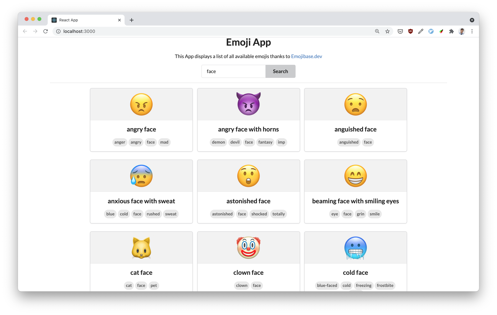

# Emojis App

This is an App to demonstrate and practice pair programming. It uses the Emoji JSON API
from [milesj/emojibase](https://github.com/milesj/emojibase)

## Setup

Steps:

* Clone this repo
* Install dependencies `npm install`
* Run with `npm start`

## API

The API is simply a giant JSON array with objects representing emojis. The JSON API dataset can be found [here](https://raw.githubusercontent.com/milesj/emojibase/master/packages/data/en/data.raw.json)

## Pair Programming Workshop

### Goal

Practice adding a feature or solving a problem in an app that requires applied knowledge of Data Structures & Algorithms 

#### Best practices (15 min)

* Create a new branch for any new feature.
* Asks clarifying questions
* Verify Assumptions
* Write valid, syntactically correct code for the full algorithm 
* Uses proper indentation to make code readable
* Selects descriptive names for variables/functions that follow standard casing conventions
* Verbalizes thought process throughout

### Exercises

#### Implement filtering of emojis by their `annotation` property. 

For example, search for emojis with the word 'face'

* Sort the results Alphabetically

### Tag filters

At the top the app display a button for each tag in the entire dataset. The buttons should also display how many emojis have the given tag. Clicking in a tag button will then filter the list only showing the emojis that match that tag. For example, if I click the tag button "man" only the 89 emojis that have the tag "man" will show.

#### Implement filter of emojis by tags

For example,  have an input field where users can type a tag for example “eye” and button to submit. Display all emojis that have the tag “eye” in their `tags` property

#### Find the n most common tags

Return number of times a tag appears. (accumulating). For example, the 4 most common tags in this dataset are:

* tag: "man", occurrences 89
* tag: "woman", occurrences: 93
* tag: "face" occurrences: 135
* tag: "flag", occurrences: 262

⚠️ This can be a function `nCommonTags(emojis, n)` that takes in the entire emojis array and a number n and returns an array with the `n` most common tags. Displaying this result in the app is optional.

#### Group emojis by group set and return desc/asc.

For example, return an array of emojis that have the `group` property between 92 and 98. Which corresponds to the  “Negative” emojis.
